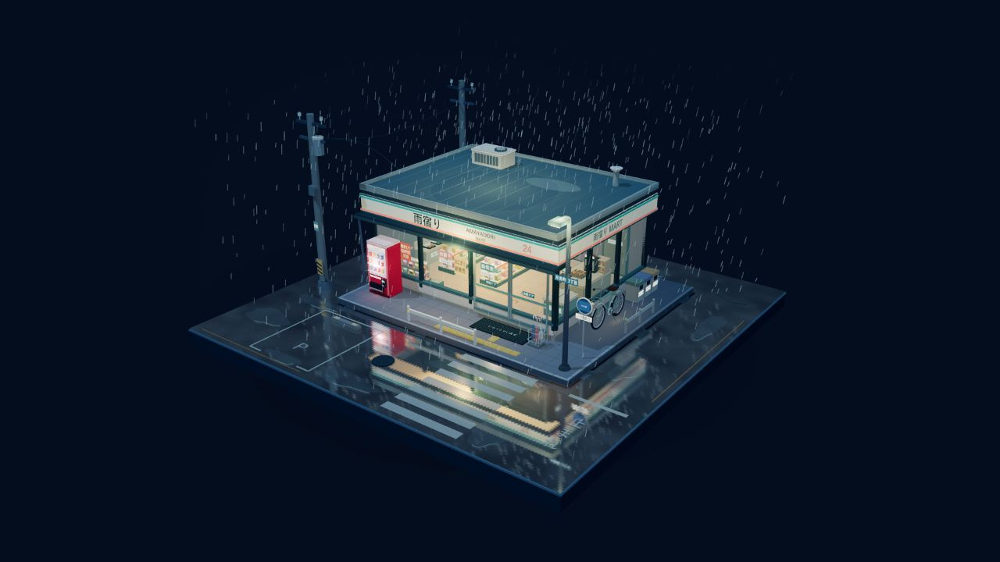

<div align="center">

<h1>&nbsp;Varesa World 3D</h1>

**瓦雷莎 · 雨夜便利店**

走进一座微缩的日式雨夜街角，在便利店里逛一逛、拿起物品，再撑伞回到街上。

<p>
  
  <a href="LICENSE"></a>
  
  
</p>
<p>
  
  
</p>

[场景与玩法](#features) · [观赏版下载](#release) · [完整互动版](#quick-start) · [操作指南](#controls) · [文件归类](#layout) · [常见问题](#faq) · [素材来源](#provenance) · [许可证](#license)

</div>

---

Varesa World 3D 是基于 **Three.js** 的第三人称互动场景。便利店、街道、灯光、雨水和大部分道具由代码构建；角色使用瓦雷莎的官方 MMD 模型，走跑动作由 CMU 动捕数据适配。当前版本适合单人探索，浏览器中的进度只保留到本次页面关闭或刷新。

<div align="center">
  
  <p><sub>可公开下载的街角观赏版画面，不含人物与购物玩法</sub></p>
</div>

> **关于两个版本**：GitHub 仓库提供源码与构建脚本；Release 可提供**无角色的街角观赏版**。完整互动版的 HTML 内嵌官方角色模型与贴图；原模型说明禁止二次配布，所以该 HTML 和本地游玩包保留在各自电脑上。想玩完整互动版，需要自行从原始发布页取得模型并在本地构建。

<a id="features"></a>

## 场景与玩法

| 内容 | 可以做什么 |
| --- | --- |
| **雨夜街角** | 从第三视角探索正方形微缩底座上的便利店、斑马线、后巷、贩卖机和街边设施 |
| **进店购物** | 穿过自动门，查看货架、冷柜、便当、饭团、杂志与收银台；店内商品先放入购物篮，再结账 |
| **物品互动** | 借伞、开关设施、买饮料、煮咖啡、读物、骑自行车、搬动箱子，并处理吃完留下的包装 |
| **背包与手持** | 按分类查看、搜索、取出、收纳和使用物品；雨伞可收纳、合拢手持或撑开 |
| **纯观赏模式** | 隐藏人物与界面，旋转和缩放整个雨夜模型 |

场景包含 **175 个互动目标**，其中 **143 个为可拿取商品**。街角与店内使用不同的灯光和环境声；湿地反光、雨丝、积水波纹与霓虹辉光共同营造动画雨夜氛围。

上表介绍的是**完整互动版**。公开观赏版保留街角模型、雨夜灯光和自由观察操作，不包含人物、背包或购物互动。

<a id="release"></a>

## GitHub Release：街角观赏版

准备上传到 [GitHub Releases](https://github.com/w2902171175/Varesa-World3D/releases) 的文件位于本地 `release/`：

| 本地文件 | 用途 | 上传建议 |
| --- | --- | --- |
| `Varesa-World3D-rainy-corner-viewer-v1.0.0.zip` | 观赏版 HTML、使用说明及两份许可证 | **主要 Release 附件** |
| `Varesa-World3D-rainy-corner-viewer-v1.0.0.html` | 单文件观赏版，下载后可直接双击 | 可选附件 |
| `UPLOAD-INSTRUCTIONS.txt` | 给上传者的文件清单与区别说明 | 留在本地 |

观赏版支持鼠标拖动旋转、滚轮缩放、右键平移和触屏操作；无需安装 Node.js，也不包含瓦雷莎模型。该 `release/` 目录整体被 `.gitignore` 排除，**由仓库所有者手动上传 ZIP 到 GitHub Release**。源码克隆后运行 `npm ci`、`npm run package:viewer` 可重新生成相同用途的交付文件。

<a id="quick-start"></a>

## 完整互动版：本地构建

### 准备并构建

需要 **Node.js 20 或更新版本**。先按 [角色来源说明](assets/character/SOURCE.md) 中的原始发布页自行下载官方模型，并将文件完整解压到 `assets/character/official/`。确认该目录直接包含角色 `.pmx`、`skin.bmp`、`hair.bmp`、`tex/` 和 `sph/` 等文件。

在项目根目录执行：

```powershell
npm ci
npm run prepare:character
npm run build
```

构建完成后，双击 **`Output/瓦雷莎·雨夜便利店.html`** 即可离线游玩。`Output/index.html` 是同目录下的轻量入口，会自动打开主游戏。角色、贴图与脚本已内嵌在主 HTML 中，本机双击游玩不需要保持服务运行。

> 上面的 `Output/` 文件是在**本地完成构建后才会出现**的，既不在仓库文件列表里，也不是公开 Release 的下载文件。已有完整的本地工作目录可以直接打开原先生成的 HTML。

### 本机游玩与分享

完成构建后，双击项目根目录的 **`start.bat`**。菜单提供三种方式：

| 选择 | 模式 | 访问方式 |
| --- | --- | --- |
| **1，默认** | 仅本机游玩 | 直接回车；浏览器打开 `127.0.0.1` 地址 |
| **2** | 局域网分享 | 将窗口中的局域网地址发给同一 Wi-Fi／局域网的朋友 |
| **3** | 临时公网分享 | 等窗口显示“**发给朋友的网址**”后再复制链接 |

也可以在终端直接指定模式：

```powershell
.\start.bat --local
.\start.bat --lan
.\start.bat --public
```

启动器会自动打开本机游戏，并将本次地址写入根目录的 `游玩地址.txt`。`127.0.0.1` 只供这台电脑访问。公网模式使用临时 Cloudflare Tunnel：首次需要联网下载连接工具，链接会随重新启动而变化。朋友各自运行独立的单机页面，不同步人物、购物篮或进度。

启动窗口按 **Enter** 可结束这一次服务；双击 **`stop.bat`** 可停止本项目正在运行的本机服务和公网隧道。已经载入浏览器的页面可能继续运行，刷新后将无法连接已停止的服务。再次运行 `start.bat` 即可启动新会话。

<a id="controls"></a>

## 操作指南

| 操作 | 功能 |
| --- | --- |
| **WASD／方向键** | 按当前相机方向移动 |
| **Shift** | 点按一次切换行走／奔跑；松开移动键会停下，奔跑模式仍保留 |
| **鼠标移动／滚轮** | 转动跟随视角／调整相机距离 |
| **按住 Alt** | 显示鼠标并暂停镜头转动，方便点击界面；松开恢复 |
| **F** | 靠近并面向物品后交互 |
| **R** | 使用已付款商品；也用于切换饮品、翻页、下车或放下箱子 |
| **B／U** | 打开背包／撑开或合拢已装备的雨伞 |
| **Tab** | 切换没有人物和界面的观赏模式 |
| **Esc／Home** | 暂停视角并释放鼠标／重置跟随相机 |

店内拿起的商品进入待付款购物篮；到收银台按 **F** 结账后，商品才进入背包。背包支持分类、搜索、查看详情、取出和使用。雨伞收进背包后会从手上隐藏，再装备时先保持合拢。打开背包或阅读时视角暂停；按过 Esc 后，点击场景可恢复鼠标转向。

<a id="development"></a>

## 开发与检查

| 目录／文件 | 用途 |
| --- | --- |
| `src/` | 街景、店铺、角色控制、相机、碰撞、交互、背包与雨夜效果 |
| `assets/motion/` | CMU 原始动作、处理脚本、循环数据及来源说明 |
| `assets/character/` | 模型来源与本地资源生成脚本；实际模型及生成的 `embedded.js` 被 Git 忽略 |
| `viewer/` | 不含角色模型的街角观赏版源码和单文件构建脚本 |
| `tests/`、`qa/` | 自动化测试、手动检查脚本与历史核对记录 |
| `build.mjs`、`serve.mjs` | 将游戏打包为单个离线 HTML；开启本机预览服务 |
| `start.bat`、`stop.bat` | 本机／局域网／公网启动与项目服务停止 |

常用检查命令：

```powershell
npm test
npm run build:viewer
npm run package:viewer
npm run audit:secrets
npm run test:source
npm run serve
```

`npm test` 检查控制、相机、碰撞、背包、交易与角色动作。有本地模型时会运行真实 PMX 骨骼测试；从 GitHub 克隆且尚未安装模型时，该测试明确跳过。`build:viewer` 与 `package:viewer` 不需要角色模型，分别生成观赏版 HTML 和 Release ZIP。`audit:secrets` 扫描 Git 候选文件中的常见密钥格式，仅显示文件名和规则；`test:source` 在临时目录验证只含仓库文件的克隆状态。需要重新生成角色动作预览时，先准备本地模型，再运行 `node qa/motion/build-preview.mjs`。

<a id="layout"></a>

## 文件归类

| 位置 | 归属 | 说明 |
| --- | --- | --- |
| `src/`、`viewer/`、`scripts/`、`assets/motion/`、`docs/` | GitHub 仓库 | 游戏源码、观赏版源码、动作数据、仓库图标与无角色场景预览图 |
| `assets/character/SOURCE.md`、`assets/character/prepare-assets.mjs` | GitHub 仓库 | 模型来源及本地处理步骤，不含模型数据 |
| `release/` | **Git 忽略；手动传 Release** | 可公开的无角色观赏版 HTML、ZIP 与许可证 |
| `Output/` | **仅本地；不可作为公开附件** | 包含瓦雷莎模型的完整游戏 HTML、本地游玩包及说明 |
| `assets/character/official/`、`assets/character/embedded.js` | **仅本地** | 官方原模型、贴图和从其生成的内嵌资源 |
| `node_modules/`、`.runtime/`、`游玩地址.txt` | Git 忽略 | 可重建依赖与运行状态 |

**请使用 Git 或 GitHub Desktop 提交仓库文件**；不要把整个本地目录打包或拖入 GitHub 网页上传，因为网页手动上传不会按本地 `.gitignore` 筛选。Release 上传前请按 `release/UPLOAD-INSTRUCTIONS.txt` 核对附件。

<a id="faq"></a>

## 常见问题

**克隆仓库后为什么没有完整互动版的 HTML？** 该文件内嵌官方角色模型与贴图，因原模型使用说明禁止二次配布，所以仓库只上传源码。按[完整互动版构建步骤](#quick-start)下载原模型并在本地生成；只想看场景可下载[无角色观赏版](#release)。

**双击 HTML 和运行 `start.bat` 有什么区别？** 已构建的主 HTML 可以直接离线游玩；`start.bat` 会启动服务，适合自动打开本机页面或给同一局域网、外网的朋友网址。

**朋友能和我一起出现在同一个世界吗？** 当前是各自独立的单人场景。分享功能提供访问链接，不同步人物、物品或进度。

**公网链接打不开？** 等启动窗口明确显示“发给朋友的网址”，并保持电脑和窗口运行。若本机提示域名无法解析，可检查本机 DNS 缓存或代理的 DNS 设置；自己仍可用窗口中的 `127.0.0.1` 地址游玩。

**刷新页面后购物记录还在吗？** 当前游戏状态只保存在页面会话里，刷新或关闭会重置钱包、购物篮和道具位置。

<a id="provenance"></a>

## 素材来源与使用范围

- **角色**：瓦雷莎 MMD 模型由 **miHoYo** 提供、**观海（观海子）** 改造；原始发布页、校验值和转换说明见 [assets/character/SOURCE.md](assets/character/SOURCE.md)。原始说明禁止商用、模型二次配布及拆取部件改造其他模型。本仓库不包含模型、贴图或内嵌模型的离线文件。
- **动作**：步行与跑步使用 Carnegie Mellon University Graphics Lab Motion Capture Database 的 `35_01`、`35_17`，经本项目重定向；跳跃及交互层为项目制作。它们不是从《原神》游戏中提取的动画。来源和使用说明见 [assets/motion/SOURCE.md](assets/motion/SOURCE.md)。
- **Three.js**：使用 npm 安装的 Three.js。执行 `npm run build` 后，其许可文件复制到本地 `Output/THREE-LICENSE.txt`。

The data used in this project was obtained from mocap.cs.cmu.edu. The database was created with funding from NSF EIA-0196217.

<a id="license"></a>

## 许可证

本项目采用 [MIT License](LICENSE)，支持在保留版权与许可声明的前提下使用、修改和分发。

Copyright © 2026 [w2902171175](https://github.com/w2902171175)。第三方依赖保留各自的许可证。
